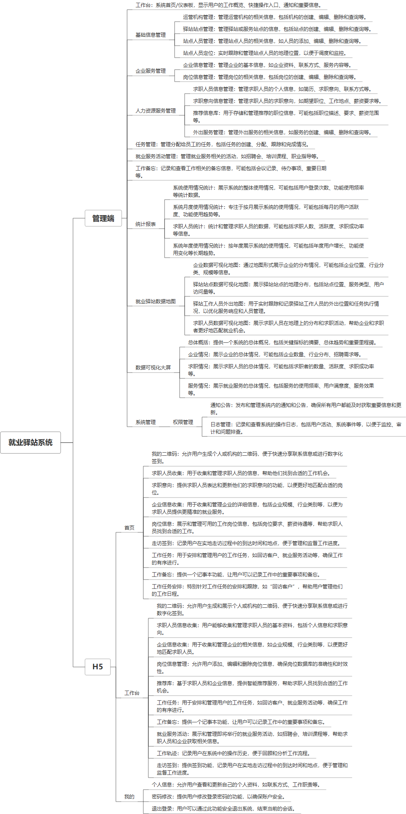

 

    
 

公司拥有上百套具有自主知识产权的软件系统，详情请查看码云首页或公司官网

 
<h1>就业驿站</h1>

<a href="https://www.haishi.net.cn/">公司官网</a> ｜ <a href="https://www.haishi.net.cn/">在线体验</a>

 

## 系统介绍

就业服务活动、招聘、求职等
本项目名称为就业驿站管理系统，是为促进高校毕业生就业，搭建高校与企业之间沟通桥梁的系统平台。该系统主要包括基础信息管理、企业服务管理、人力资源服务管理、任务管理、就业服务活动管理、工作备忘、统计报表、就业驿站数据地图、数据可视化大屏、系统管理等模块。本系统从用户层面可以分为一个端：
- 管理端：高校、企业、驿站工作人员、求职者使用，可以进行信息管理、岗位管理、求职、推荐、数据统计等
                

## 系统功能介绍

### 系统包含终端说明

管理端（WEB）、用户端（H5）

| 序号 | 模块                | 模块说明 |
| ---- | ------------------- | -------- |
| 1    | ZF-ZPPT-JYYZ-SERVER | 服务端   |
| 2    | ZF-ZPPT-JYYZ H5     | 未知类型 |
| 3    | ZF-ZPPT-JYYZ-MANAGE | 管理端   |

### 系统功能结构

### 系统功能说明

- 基础信息管理：对运营机构、驿站站点、站点人员等信息进行管理，为系统其他功能提供数据支撑
- 企业服务管理：管理企业信息和岗位信息，为高校毕业生提供就业岗位
- 人力资源服务管理：管理求职人员信息，收集求职意向，建立推荐信息库，提供外出服务，为高校毕业生提供就业指导和服务
- 统计报表：对系统使用情况、求职人员等进行统计分析，为高校和相关部门提供决策依据
- 就业驿站数据地图：对企业、驿站站点、求职人员等数据进行可视化展示，直观地呈现就业市场的供需情况

## 系统主要界面

## 系统技术说明

### 代码模块说明

| 序号 | 目录                      | 目录说明 |
| ---- | ------------------------- | -------- |
| 1    | ZF-ZPPT-JYYZ-SERVER/lib   | --       |
| 2    | ZF-ZPPT-JYYZ-SERVER/.idea | --       |
| 3    | ZF-ZPPT-JYYZ-SERVER/src   | --       |

### 系统技术选型

#### 开发语言/框架

JAVA（JDK1.8）
前端框架：VUE2
框架：SpringBoot2.x
系统结构：单体应用

#### 服务中间件

Nginx
Tomcat

#### 数据库

MySQL（5.7+）

#### 其他说明

无

## 系统演示/商用

请扫码添加客服微信获取演示地址和系统详细资料。

如果您想基于就业驿站进行商业化交付或定制开发服务，我们提供有偿的技术服务支持，合作模式不限，欢迎沟通！

公司官网地址： <a href="https://www.haishi.net.cn/">https://www.haishi.net.cn</a>

联系客服获取专业回答。

## 使用须知

1、 本项目商用必须获得版权所有者的授权。

2、 未经允许本项目代码不允许二次出售。

